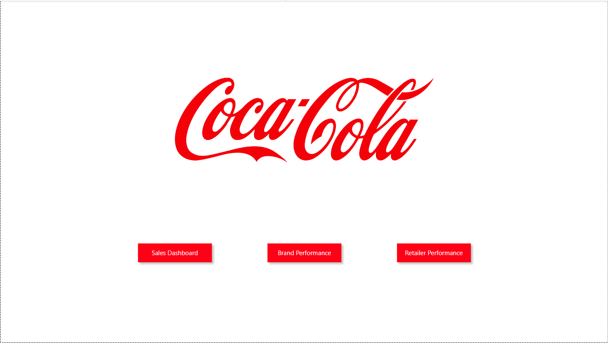
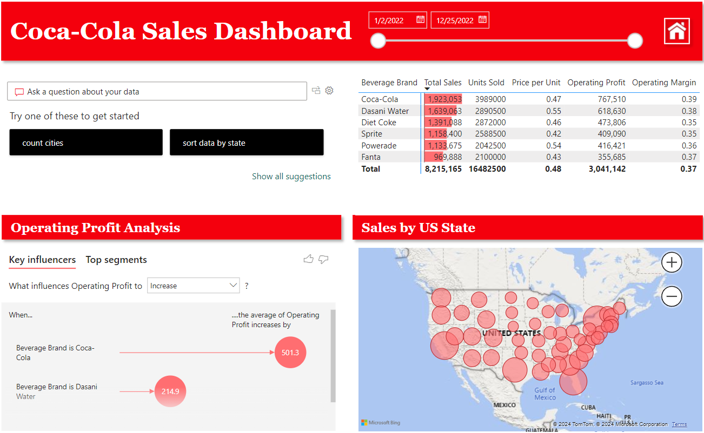
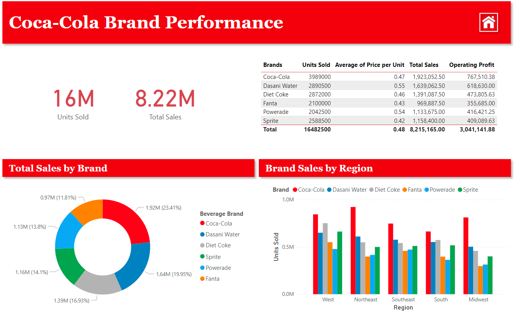
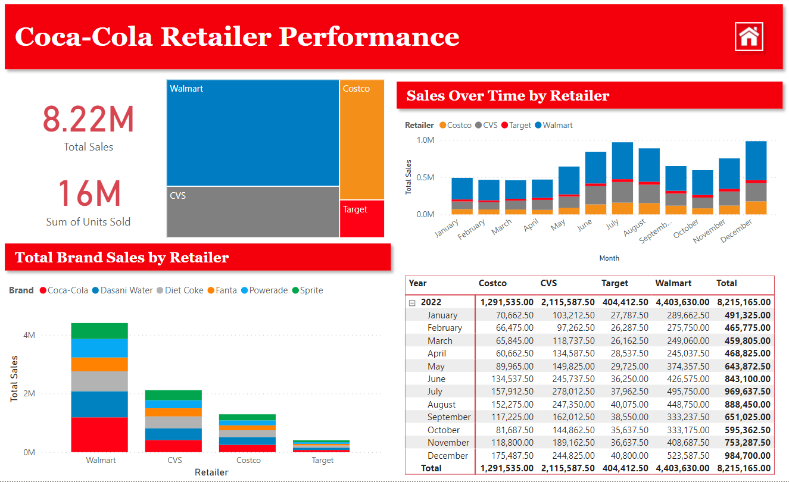

# Coca-Cola Sales Analysis
Prepared by **Chad Lines**
## The Goal
- My goal with this project is to analyze sales of the Coca-Cola brands within the contiguous united states
## Preparing and Loading the Data
- The data came in an Excel file and was very well structured ahead of time
    - After reviewing the data, I decided that I could load it directly into *Power BI* needing to clean or transform the data at all.
## Creating the Visuals
- My goal with visuals is to keep them simple while also portraying the information in a complete and usable way
- I planned to create 4 pages:
    1. **HomePage:** This would be a simple landing page with links to the other reports
    2. **Sales Dashboard:** This would provide general and overall sales figures
    3. **Brand Performance:** This would break down the sales figures by *brand*
    4. **Retailer Performance:** This would break down sales figures by *retailer*
### The Home Page
- This was simple enough - just the company logo, and buttons to the other pages.

---

### Sales Dashboard
- The Sales Dashboard was the second page I created
- As mentioned this was just a basic overview of sales in the contiguous United States
- It contains the following elements:
    1. A date splitter so that sales figures can be viewed within a specific date range
    2. An AI-Powered Q&A where the viewer can ask questions about the data and get quick answers
    3. An overview of total sales by brand as a Matrix card
    4. A Key Influencer card that shows which brands impact the companies Operating Profits the most

---

### Brand Performance
- This breaks down the sales performance of each brand
- It contains the following elements:
    1. I provided a few cards to show **Units Sold** and **Total Sales**
        - The power of these cards come in the fact that they will update based on whatever brand is selected in the other cards
        - E.x. Selecting *Sprite* in the Matrix, will update these cards to reflect the **Units Sold** and **Total Sales** specifically for that brand
    2. A Matrix showing the Brands and a few key metrics:
        - Total Units Sold
        - Average Price per Unit
        - Total Sales
        - Operating Profit
    3. A look at Total Sales by Brand - this further illustrates the power of Coca-Cola's brand portfolio
    4. A card showing how the brands sell in the various regions of the United States

---

### Retailer Performance
- This breaks down the sales performance of each retailer
- It contains the following elements:
    1. Again, I included cards to show **Units Sold** and **Total Sales**
    2. I also included a TreeMap card that shows proportions of total sales per retailer
        - I also included this for *ease of use* - it's easy to click on any of the retailers and sort the data thusly
    3. A card showing the total brand sales by retailer
    4. A card showing the sales over time for each retailer
    5. A matrix showing a break-down of total sales - breaking it down by retailer and month.
        - Matrixes like this are not always user-friendly. However, I think it offers a good way to be able to further filter the data - the user can click on a month, for example, and have the visuals update to include that month
        - The user can also select *multiple* months to view the data over a longer period of time

---

## Conclusion
- The utilization of Power BI dashboards has provided valuable insights into Coca-Cola's sales performance across the contiguous United States. 
- Through the interactive visualization of data, we have gained a comprehensive understanding of:
    - **Regional variations**
    - **Seasonal trends**
    - **Product preferences within the target market** 
- Overall, this project underscores the significance of leveraging advanced analytics tools like Power BI to drive actionable insights and enhance business outcomes in the competitive beverage industry landscape.